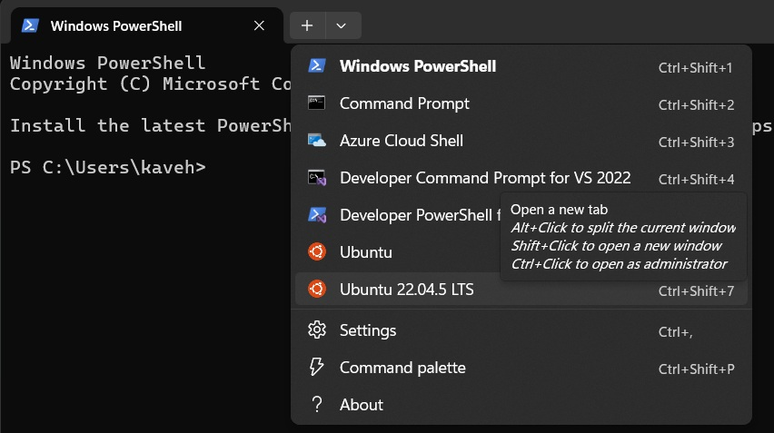

# Setting up Ubuntu on Windows using WSL


## Introduction

If you want to develop code or work with Ubuntu OS but only have a Windows machine, Windows Subsystem for Linux (WSL) provides an excellent solution. It allows you to run a genuine Linux environment, like Ubuntu, directly on Windows, tightly integrated with your system. This avoids the need for dual-booting or a separate Linux PC. This tutorial guides you through installing Ubuntu 22.04 using WSL on Windows.

## WSL Setup

Follow these steps to get WSL and Ubuntu 22.04 running:

1.  **Install Windows Terminal (recommended):** While optional, Windows Terminal provides a modern, tabbed interface for accessing PowerShell, Command Prompt, and your WSL distributions. Install it from the Microsoft Store: [Windows Terminal](https://apps.microsoft.com/detail/9n0dx20hk701?hl=en-US&gl=US)
2.  **Enable WSL and Install Ubuntu 22.04:**
    * Open **PowerShell as Administrator**
    * Run `wsl --install -d Ubuntu-22.04`. This command enables necessary Windows features, installs the WSL kernel, and downloads/installs the Ubuntu 22.04 distribution
    * Follow the on-screen prompts, which will include creating a username and password for your Ubuntu environment
    * For detailed instructions or troubleshooting, refer to the official Microsoft guide: [Install WSL](https://learn.microsoft.com/en-us/windows/wsl/install)
3.  **Update WSL (optional but recommended):** Ensure you have the latest WSL version by running `wsl --update` in PowerShell.
4.  **Running Linux GUI Apps:** Modern WSL versions support Linux GUI applications out-of-the-box. 
    * If you encounter issues (e.g., graphical glitches, apps not launching), you might need to update Windows or install specific graphics drivers for WSL. See the Microsoft guide for troubleshooting: [Run Linux GUI apps](https://learn.microsoft.com/en-us/windows/wsl/tutorials/gui-apps).
5.  **Accessing Files:**
    * **From Windows to Ubuntu:** Open Windows File Explorer. You should see a "Linux" section in the navigation pane where you can access your Ubuntu file system.
    * **From Ubuntu to Windows:** Your Windows drives are typically mounted under `/mnt/`. For example, your C: drive is accessible at `/mnt/c/`.
    * **Quick Access:** To open the current Ubuntu directory in Windows File Explorer, run `explorer.exe .` inside your Ubuntu terminal (note the space and the dot).

## Setting Up Ubuntu



1.  **Launch Ubuntu:** Open Windows Terminal and select "Ubuntu-22.04" from the dropdown menu (next to the '+') or type `ubuntu2204` in the Run dialog (Win+R).
2.  **Update Ubuntu:** Before installing anything else, update your package lists and upgrade existing packages:
    ```bash
    sudo apt update && sudo apt upgrade -y
    ```
3.  **Troubleshooting - restarting WSL:** Sometimes, especially after installations, software might not be immediately recognized. A restart often fixes this.
    * Close all Ubuntu terminals.
    * Open PowerShell and run `wsl --shutdown`.
    * Wait a few seconds, then relaunch Ubuntu from Windows Terminal.

## Conclusion

You have successfully set up Ubuntu 22.04 on Windows using WSL. This powerful combination allows Windows users to effectively participate in Linux-based ecosystems developed for research.
